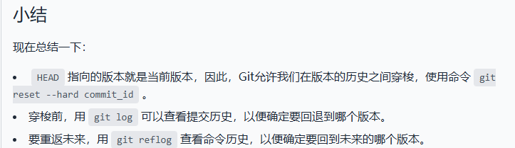
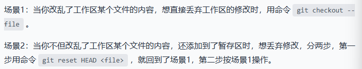
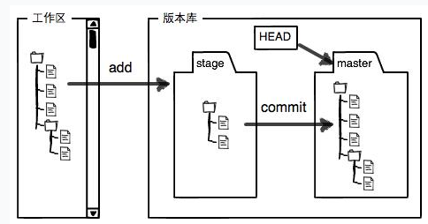

# Git安装教程

链接：[Git 详细安装教程（详解 Git 安装过程的每一个步骤）_git安装-CSDN博客](https://blog.csdn.net/mukes/article/details/115693833)

# Git教程

链接：[从远程库克隆 - Git教程 - 廖雪峰的官方网站](https://liaoxuefeng.com/books/git/remote/clone/index.html)

## 常用的Git命令

1. 创建Git仓库：生成.git文件（==隐藏==）

   ```
   git init
   ```

2. 将文件添加到仓库：

   ```
   git add filename(文件名) #可以添加多个文件
   ```

3. 将文件提交到仓库：

   ```
   git commit -m "备注/说明"
   ```

4. 查看仓库当前的状态：

   ```
   git status
   ```

5. 查看文件前后修改对比：

   ```
   git diff
   git diff HEAD -- filename #可以查看工作区和版本库里面最新版本的区别
   ```

6. 查看文件提交历史记录：

   ```
   git log #第一种方法
   git log --pretty=oneline #第二种方法（推荐）
   ```

7. 文件版本回退：

   ```
   git reset --hard HEAD^ #回退到上一个版本
   git reset --hard ID(版本号前7位) #回退到指定版本（通过git log或git log --pretty=oneline 查看版本号
   ```

8. 查看历史命令：

   ```
   git reflog #通常用于回退版本后悔，通过查找版本号进行跳转回未来的版本
   ```



9. 撤销修改：

   ```
   git chekout -- file #丢弃工作区的修改(其实是用版本库里的版本替换工作区的版本)
   git reset HEAD file #可以把暂存区的修改撤销掉，重新放回工作区
   ```

   

10. 删除文件

    ```
    git rm file #先删除文件
    git commit -m "说明" #提交
    git checkout -- file #文件误删，通过这个命令可以恢复到最新版本
    ```

11. 创建SSH key 

    在用户主目录里找到`.ssh`目录，里面有`id_rsa`和`id_rsa.pub`两个文件，这两个就是SSH Key的秘钥对，`id_rsa`是私钥，`id_rsa.pub`是公钥。如果没有就创建：

    ```
    ssh-keygen -t rsa -C "youremail@example.com"
    ```

12. 添加远程库：

    ```
    git remote add 别名(远程库名) git@github.com:huc-a/远程库名.git #第一步，关联远程库
    git push 别名 master #第二步，本地库的所有内容推送到远程库上(第一次推送：git push -u 别名 master)
    ```

13. 查看远程库信息：

    ```
    git remote -v
    ```

14. 删除远程库：

    ```
    git remote rm 别名
    ```

15. 克隆远程库

```
git clone git@github.com:huc-a/远程库名.git 
```


## 概念

1. 工作区和暂存区

   Git的版本库里存了很多东西，其中最重要的就是称为stage（或者叫index）的暂存区，还有Git为我们自动创建的第一个分支`master`，以及指向`master`的一个指针叫`HEAD`。



第一步是用`git add`把文件添加进去，实际上就是把文件修改添加到暂存区；

第二步是用`git commit`提交更改，实际上就是把暂存区的所有内容提交到当前分支。


## 注意事项

1.如果你使用Windows系统，为了避免遇到各种莫名其妙的问题，请确保目录名（包括父目录）不包含中文。==目前可以用中文目录==


