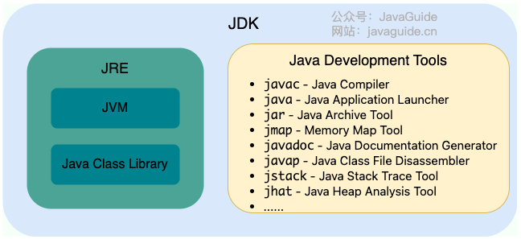

# Java知识库

参考知识库：[JavaGuide/docs/java/basis/java-basic-questions-01.md at main · Snailclimb/JavaGuide](https://github.com/Snailclimb/JavaGuide)

# 一、基础概念与常识

1. JVM、JDK、JRE的区别：

   - Java 虚拟机（Java Virtual Machine, JVM）是运行 Java 字节码的虚拟机。

   - JDK（Java Development Kit）是一个功能齐全的 Java 开发工具包，供开发者使用，用于创建和编译 Java 程序。它包含了 JRE（Java Runtime Environment），以及编译器 javac 和其他工具，如 javadoc（文档生成器）、jdb（调试器）、jconsole（监控工具）、javap（反编译工具）等。

   - JRE 是运行已编译 Java 程序所需的环境。

   - 关系图：

     